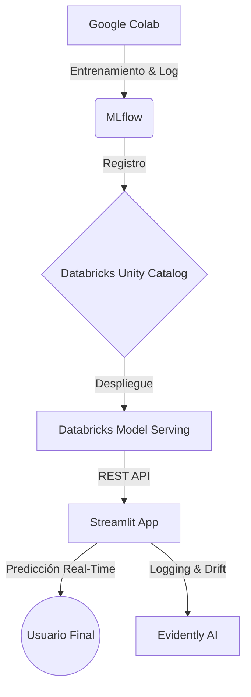

# 🛡️ Phishing Susceptibility Detection System

Sistema de detección de susceptibilidad a phishing basado en **factores humanos**, entrenado con **Gradient Boosting**, desplegado en **Databricks Model Serving** e integrado con **Streamlit** y **Evidently AI** para monitoreo y análisis de drift.

---

## 📐 Arquitectura General


---

## 🔁 Flujo de Actualización del Modelo (CRÍTICO)

Cuando se entrena un **nuevo modelo**, **NO se crea un nuevo endpoint**.  
Se **actualiza la versión del modelo servido** en el endpoint existente.

---

## 1️⃣ Entrenamiento del Modelo (Google Colab)

El entrenamiento se realiza en **Google Colab**, usando `mlflow` conectado a Databricks (Unity Catalog).

### Configuración inicial

```python
import mlflow
mlflow.set_registry_uri("databricks-uc")
```


El modelo se registra siempre con el mismo nombre:

```python
registered_model_name = "workspace.default.phishing_detector_tree"
```

Nota: Cada entrenamiento exitoso crea una nueva versión (v1, v2, v3...).

## 2️⃣ Verificar la Nueva Versión en Databricks
En el Databricks Workspace, navega a Models > Buscar phishing_detector_tree y verifica:

✅ Nueva versión creada.

✅ Métricas registradas correctamente.

✅ Signature definida (Input/Output). Requisito obligatorio para serving.

## 3️⃣ Actualizar el Modelo en Serving (PASO CRÍTICO)
1. Ir a la sección Serving.
2. Seleccionar el endpoint existente (ej: api_phishing).
3. Clic en Edit / Update configuration.
4. En la sección Served Models, cambiar la versión del modelo:
- phishing_detector_tree : v2
+ phishing_detector_tree : v3  <-- Seleccionar la nueva versión aquí
5. Guardar cambios. El endpoint se reiniciará automáticamente sin cambiar la URL.

## 4️⃣ Verificar el Endpoint
URL del Endpoint: https://<DATABRICKS-HOST>/serving-endpoints/api_phishing/invocations

### Payload de Prueba (JSON)
```json
{
  "dataframe_records": [
    {
      "Fatiga_Global_Score": 1.8,
      "Big5_Responsabilidad": 3.9,
      "Big5_Apertura": 4.1,
      "Demo_Generacion_Edad": 3,
      "Demo_Rol_Trabajo": 2,
      "Demo_Horas": 4
    }
  ]
}
```

## 📊 Streamlit & Monitoreo (Evidently AI)
Actualización de la App
Normalmente no es necesario cambiar el código de Streamlit al actualizar el modelo, a menos que:

Se agreguen nuevas variables (features).

Cambie el orden o nombre de las columnas.

Sistema de Logging
Las predicciones en producción no se guardan en Databricks (limitación Community), se guardan localmente en: production_predictions.csv

```table
```
